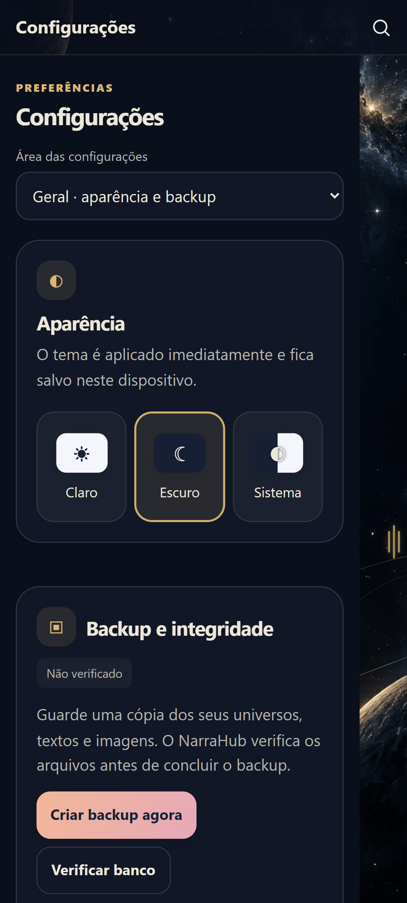
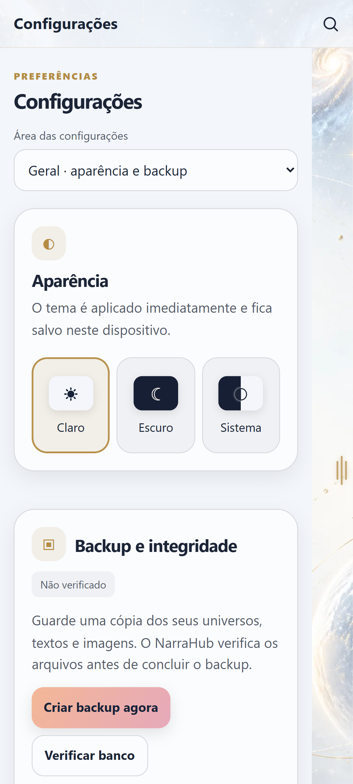
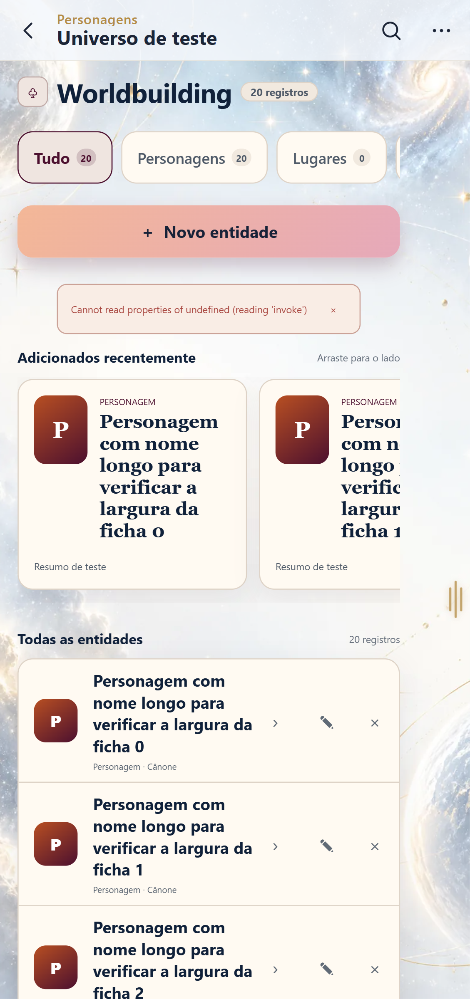

# NH-085 — Qualificação da primeira fatia mobile V2

Data: 2026-09-30. Linha de integração: `mobile-shell`. Versão: `0.10.0-beta.13`.

## Escopo implementado

- Cinco áreas de configurações: seletor nativo no mobile, cartões opacos, hierarquia compacta,
  tipografia legível, controles de 48px e prévias de Claro/Escuro/Sistema.
- Filtros e criação de entidades em linhas distintas; categorias continuam rolando internamente.
- Margem de 48px no conteúdo do shell para não disputar toques com a alça do relógio lateral.
- Instalação e recomendação de IA local condicionadas a `localStatus.supported`, contrato nativo
  existente. API própria e desativação continuam disponíveis; envio de contexto ao provedor informado.
- Desktop conserva sua navegação e composição. Não há navegação inferior nem novo submenu.

## Verificação visual e geométrica

Chromium com toque, sem Tauri, com dados fictícios nos stores quando necessário:

| Verificação | Resultado |
| --- | --- |
| Cinco áreas × Claro/Escuro × larguras 375/390/412/430px | 40 combinações PASS: documento e componente sem transbordamento horizontal; controles fora da alça |
| Sistema com mudança de `prefers-color-scheme` | PASS para claro e escuro |
| Entidades: filtros, criação e lista com 20 nomes longos nas quatro larguras | PASS: botão abaixo dos filtros; controles da lista dentro da linha; abrir/cancelar criação |
| API própria: campos preenchidos com valores longos em 375/412px | PASS: campos editáveis, 16px e dentro da área útil; nenhuma requisição enviada |
| Desktop em 1366×768, claro/escuro | PASS: abas visíveis, seletor mobile oculto, sem alargamento da página |
| Gerenciador de IA com capacidade Windows simulada | PASS: modo local e gerenciador presentes; nenhum modelo instalado |

Capturas reais do navegador, inspecionadas visualmente:

## Testes e limites

- Build Angular e arquitetura: PASS, 105 testes de arquitetura.
- Núcleo Rust: 893 PASS, 0 falhas, 3 ignorados.
- Prompts de IA: 5 PASS; não houve alteração dos prompts nem da execução da IA.
- Suíte Playwright completa: 153 PASS, 0 falhas, 17 casos ignorados conforme o shell
  (170 casos entre quatro celulares e desktop); execução local com dois workers.
- O teste de peteleco dependia da latência entre chamadas CDP. Eventos agora têm duração explícita
  de 40ms nesse caso; os mesmos eventos reais de toque e as mesmas expectativas são usados.
  A física de produção não foi alterada. Repetição isolada: quatro larguras PASS.
- Os testes existentes de configurações passaram a selecionar a área pelo controle do shell ativo.

Esta evidência não qualifica teclado, insets, desempenho, permissão de câmera nem gestos de sistema
no S23 físico para esta apresentação. Os PASS físicos da beta.13 pertencem à correção anterior de
QR. NH-085 permanece `IN_PROGRESS`; M15 físico e demais páginas ainda devem ser concluídos.

## Próxima fatia

Biblioteca e criação de universo; depois escrita e ferramentas, entidades completas, relações,
timeline, planejamento e histórico, sempre com os dois temas, estados preenchidos e regressão desktop.
O escopo adiado de mDNS/BLE/tela unificada permanece fora desta fase de implementação.
