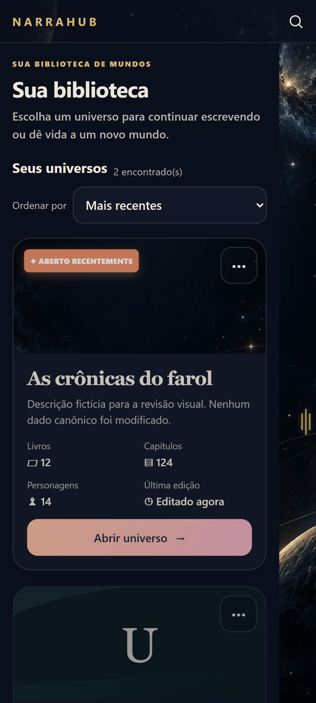
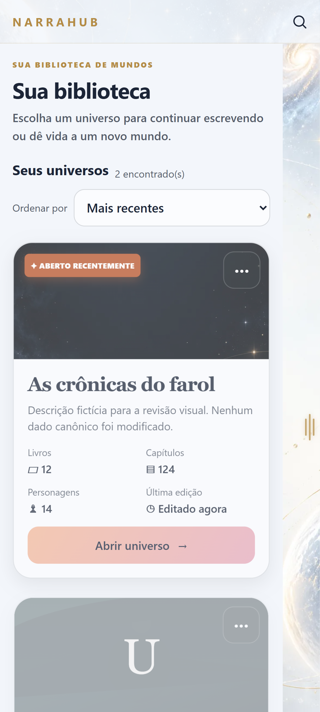
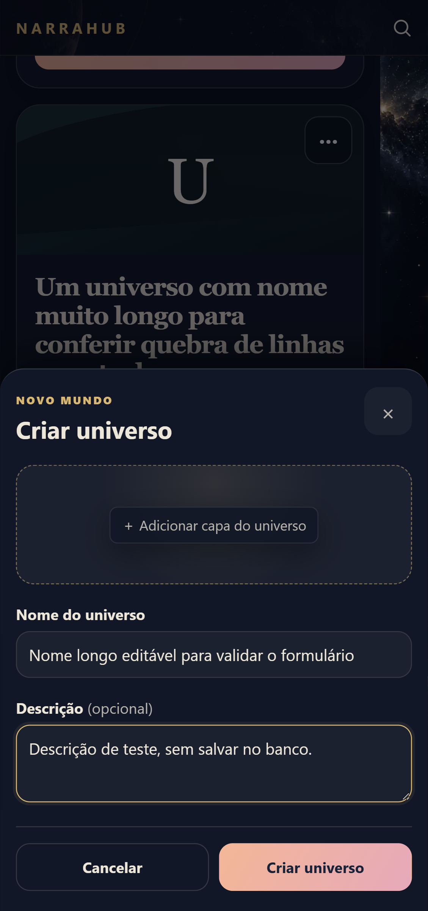
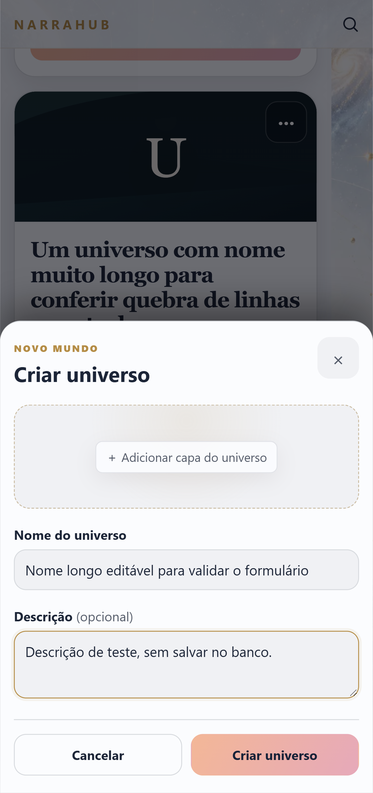

# NH-085 — Qualificação da segunda fatia mobile V2

Data: 2026-10-02. Integração: `mobile-shell`. Versão de referência: `0.10.0-beta.13`.
Branch: `codex/nh-085-mobile-v2-biblioteca`.

## Objetivo e implementação

Modernizar biblioteca e criação/edição de universo no celular seguindo a direção V2 aprovada.

- Capa de 150px e conteúdo em fluxo normal: títulos, tags e ações não disputam espaço sobre a imagem.
- Cartões opacos, títulos com hierarquia editorial, ação principal em gradiente e controles de 48px.
- Estados vazio e preenchido, menus de editar/excluir e formulário com campos de 16px.
- Temas Claro/Escuro usando os tokens existentes; menu lateral de relógio preservado.
- Conteúdo respeita a margem de 48px da alça. Desktop mantém sua composição com título sobre a capa.
- Avisos de privacidade e exclusão refletem sincronização/compartilhamento e backup existentes.

Os stores, handlers, Router, persistência, Sync V2 e confirmação de exclusão continuam compartilhados.
Não há dependência nova, nova navegação nem alteração do protocolo nativo.

## Evidência visual e geométrica

Chromium, dados fictícios inseridos nos stores Angular; sem persistência canônica e sem Tauri.

| Cenário | Resultado |
| --- | --- |
| Claro/Escuro × 375/390/412/430px × vazio/preenchido | 16 combinações PASS: sem rolagem horizontal; ações fora da alça |
| Nomes e tags longos, capa presente/ausente, selo recente | PASS: conteúdo contido e botões acessíveis |
| Menus editar/excluir | PASS: opção Excluir inteira, sem recorte pela capa reduzida |
| Editar e criar, preenchimento e cancelamento | PASS: formulário abre, campos editáveis e cancelamento fecha |
| Exclusão | PASS: confirmação exigida, botão definitivo desabilitado antes dela; nenhuma exclusão realizada |
| Teclado simulado em 375×385px | PASS: folha e ação contidas após rolagem; campos em 16px |
| Desktop 1366×900 e 700×900, nos dois temas | PASS: shell desktop, cartão e ação contidos, sem rolagem horizontal |
| Criação/cancelamento no desktop | PASS |

Capturas reais do navegador:

## Testes locais

- Build Angular: PASS.
- Arquitetura: 105 PASS.
- Rust: 893 PASS, 0 falhas, 3 ignorados.
- Playwright `mobile-shell.spec.mjs`: 38 PASS, 0 falhas, 17 casos não aplicáveis ao shell testado.
- A primeira fatia teve a suíte completa e CI 4/4 aprovados antes do merge do PR #78.
  Esses resultados pertencem à primeira fatia; o CI da segunda será verificado no seu próprio head.

## Limites e continuidade

A redução da viewport simula espaço ocupado pelo teclado; não prova teclado Android, insets,
desempenho, gestos do sistema ou comportamento físico no S23. Salvar/excluir dados nativos não
foi exercitado por esta inspeção de apresentação. Os testes físicos de QR da beta.13 não são
qualificação física desta UI. Nenhum APK foi gerado ou publicado nesta fatia.

NH-085 e Fase 5 permanecem `IN_PROGRESS`. Próxima fatia: escrita e ferramentas, seguida de
entidades completas, relações, timeline, planejamento e histórico. M15 físico permanece pendente.
mDNS/BLE/tela unificada de dispositivos continuam adiados por decisão do usuário.
