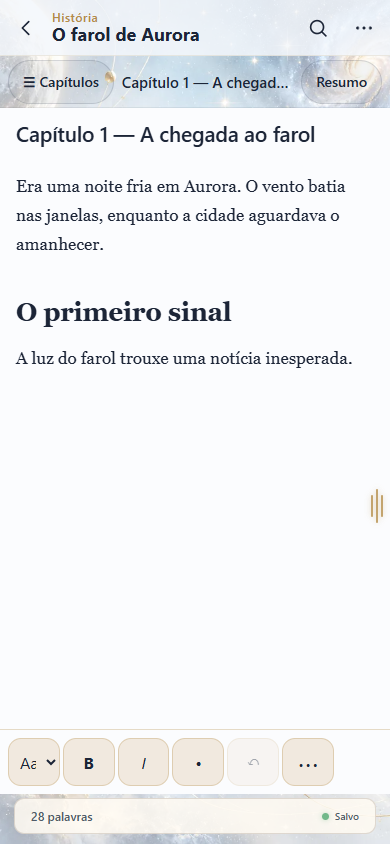
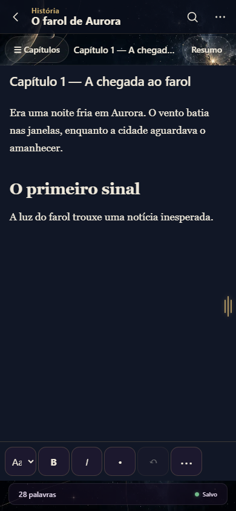
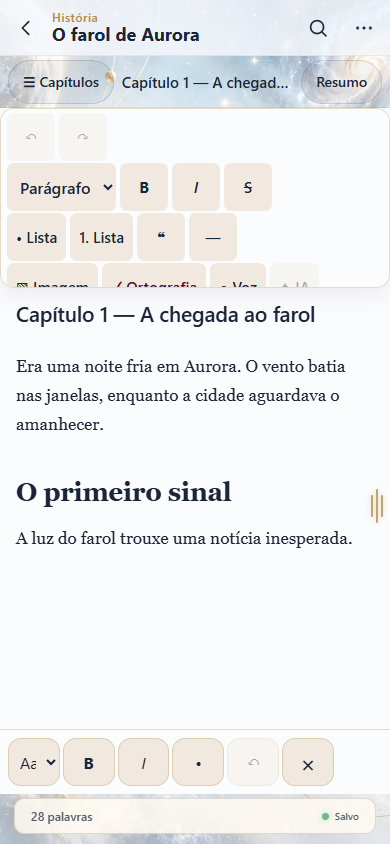
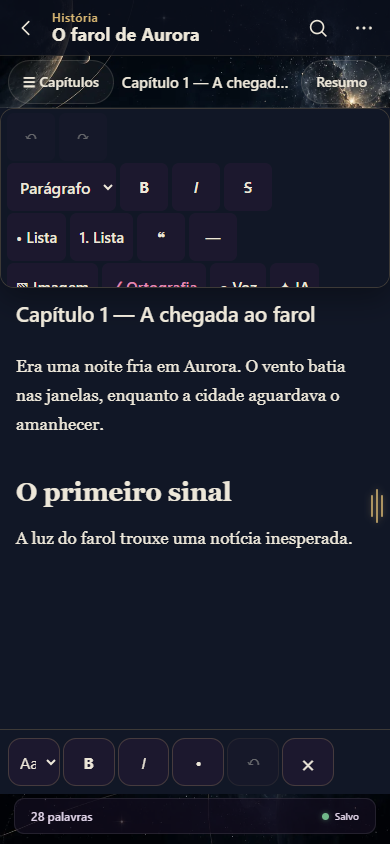
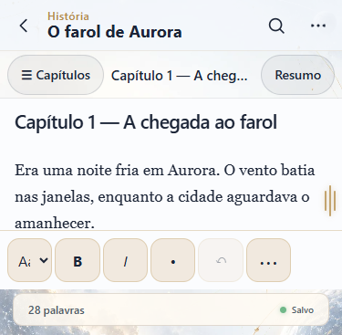

# NH-085 — Escrita e ferramentas mobile V2

Data: 2026-10-08. Branch: `codex/nh085-escrita-v2`. Base: `mobile-shell`, commit `968911a7df35a4c32ac5652b45ba64fac9c8463a`. Versão preparada: `0.10.0-beta.17`.

## Objetivo e funcionamento

Dar prioridade ao texto no celular, mantendo o menu lateral de relógio e os comandos existentes do editor. A barra de formatação oferece estilo, negrito, itálico, lista, desfazer e Mais ferramentas; a barra completa abre sob demanda e rola verticalmente. Ela é uma ferramenta do documento, sem nova navegação do app.

O documento usa superfícies opacas e tokens mobile de Claro/Escuro, título alinhado à esquerda e texto de 17px. Controles têm pelo menos 48px. Somente a barra compacta reserva espaço para a alça; o documento ocupa a largura disponível. Seleção, comandos TipTap, stores, gateway e autosave existentes são reutilizados. Os painéis de IA e comandos rápidos respeitam o viewport no celular. Não há dependência, schema ou alteração de Sync V2.

## Causa, correção e regressão

| Falha reproduzida | Correção | Evidência |
| --- | --- | --- |
| Títulos quase brancos no tema claro | Cor dos títulos igual ao token de tinta mobile | Geometria nos dois temas |
| Painel IA em 375×385: x=96,5, largura=351, direita=447,5 | Posicionamento mobile limitado ao viewport | Painel e botão de fechar contidos |
| Relógio interceptava toque em Mais ferramentas com teclado simulado | Reserva local de 56px na barra compacta | Clique real passa; nenhuma margem global adicionada |

## Validação local

Chromium com toque e fixtures nos stores Angular. Gateway de salvamento substituído por registro das chamadas; esta evidência não prova persistência nativa.

| Gate | Resultado |
| --- | --- |
| Build final, validação de UI de produção e configuração desktop | PASS, exit 0 |
| Arquitetura | 105 PASS |
| Contrato de release Android e versão | 7 PASS; beta.17 consistente |
| Geometria mobile Claro/Escuro | 18 PASS: 375×667, 390×844, 412×915, 430×932, quatro alturas reduzidas por teclado e 844×390 |
| Interação | 6 PASS: seleção/negrito, itálico, estilo ida/volta, chamada autosave, desfazer, folha de capítulos |
| Regressão existente de escrita no Playwright | 8 PASS; 2 não aplicáveis no projeto desktop |
| Desktop 1366×900 nos dois temas | 2 PASS: toolbar existente e conteúdo sem overflow |
| Revisão visual final das superfícies opacas | 4 PASS: Claro/Escuro em 390×844 e 375×367 |

Logs locais em `output/writing-build-final.log`, `output/writing-architecture.log`, `output/writing-geometry.log`, `output/writing-interaction.log`, `output/writing-desktop.log`, `output/writing-e2e-final.log` e `output/writing-visual-final.log` (artefatos ignorados pelo Git). A primeira configuração Playwright não encontrou testes; não foi contada como aprovação. O rerun correto produziu 8 PASS.

## Capturas do navegador

## Gates de entrega e próximos passos

CI Angular, Mobile (Playwright), Core Rust e Android precisam concluir SUCCESS no head exato antes do merge. Rust completo deste head será comprovado pelo CI; os 906 testes da beta.16 são referência anterior. APK assinado, tag, checksum e certificado só serão aprovados após workflow oficial e verificação dos assets.

No S23, testar teclado real, seleção por toque, Mais ferramentas, rotação, imagens, retorno ao capítulo e salvamento após reabrir. Captura de voz e execução de IA dependem das capacidades nativas/provedor e não foram aprovadas por este navegador. M15 e demais páginas permanecem pendentes. NH-085/Fase 5: IN_PROGRESS.
